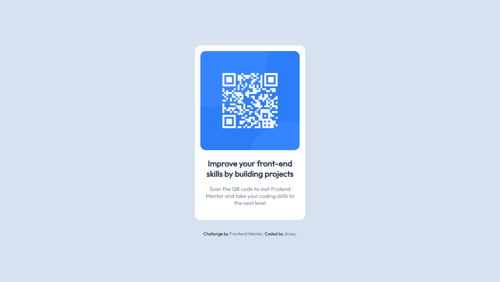

# Frontend Mentor - QR code component solution

This is a solution to the [QR code component challenge on Frontend Mentor](https://www.frontendmentor.io/challenges/qr-code-component-iux_sIO_H). Frontend Mentor challenges help you improve your coding skills by building realistic projects. 

## Table of contents

- [Overview](#overview)
  - [Screenshot](#screenshot)
  - [Links](#links)
- [My process](#my-process)
  - [Built with](#built-with)
  - [What I learned](#what-i-learned)
- [Author](#author)

## Overview

### Screenshot

 - Desktop

 - Mobile

### Links

- Solution URL: [Repository](https://github.com/Jirosu/QR_code_component)
- Live Site URL: [GitHub Pages](https://jirosu.github.io/QR_code_component/)

## My process

### Built with

- Semantic HTML5 markup
- Flexbox

### What I learned
During the process of building this challenge I applied two simple CSS concepts that I had heard about before, but had not tried until now, box-sizing property and vh unit.
- Box-sizing: I used this property with the value "border-box" to calculate more easily the size of the elements. With the value "border-box", the width and height of the content is calculate including the size of the padding and border instead of adding them to the set size of the content.

 - vh unit: I used this unit to set the minimum height of the body to 100vh thats is equivalent to the full height of the viewport, this way it allows me to center the card horizontally and vertically because the card is smaller than the body using Flexbox.

## Author

- Frontend Mentor - [@Jirosu](https://www.frontendmentor.io/profile/Jirosu)